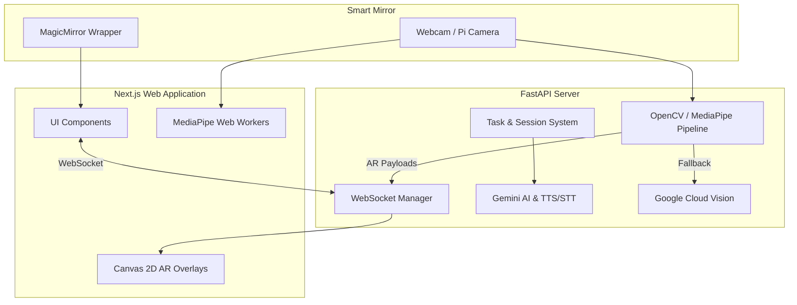

# Architecture Overview

The **NatHacks Assistive Mirror** uses a decoupled, real-time architecture optimized for low-latency computer vision processing and rich AR overlay rendering in web environments.

## System Diagram

## Core Components

### 1. Frontend (Next.js & React)
The frontend application handles the user interface, tracking rendering, and gamification feedback. It uses **Zustand** for state management, **Radix UI** for accessible primitives, and **Tailwind CSS** for styling. It features a responsive UI that works both in a desktop browser and embedded inside a MagicMirror instance.

### 2. Backend (FastAPI Python)
The backend is the computational brain of the system, managing:
- **Computer Vision Pipeline**: Processes camera frames via OpenCV and MediaPipe (Hand and Face landmarks). 
- **WebSocket Manager**: Broadcasts real-time coordinate data (`Shape` payloads) and status updates to connected clients at ~30 FPS.
- **Task System**: Tracks activity completion state, step validation, and routine logic.
- **AI Integration**: Integrates Google Cloud Vision for object detection fallbacks, and Gemini 1.5 for intelligent coaching and contextual feedback.

### 3. MagicMirror Module (`MMM-AssistiveCoach`)
A simple iframe wrapper that hosts the Next.js SPA inside the MagicMirror² Electron ecosystem. It negotiates permissions for camera access and passes along configuration variables.

## Real-Time Data Flow
1. **Capture**: The camera captures frames.
2. **Inference**: The backend (or local web worker) processes the frame through MediaPipe to extract 3D landmarks (e.g., fingertips, mouth).
3. **Task Validation**: The `MotionTracker` and `task_system` evaluate if the current landmark positions satisfy the current step's requirements (e.g., circular motion over the face).
4. **Broadcast**: The backend calculates absolute coordinates for AR shapes (rings, arrows) and streams them over WebSocket.
5. **Render**: The Next.js frontend receives the JSON payloads and draws the shapes onto an auto-sizing `<canvas>` element seamlessly layered over the mirror's UI.
